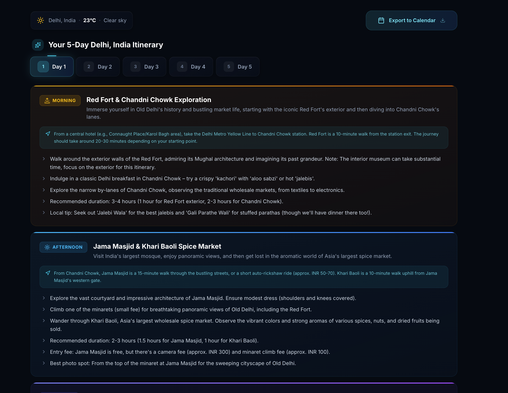
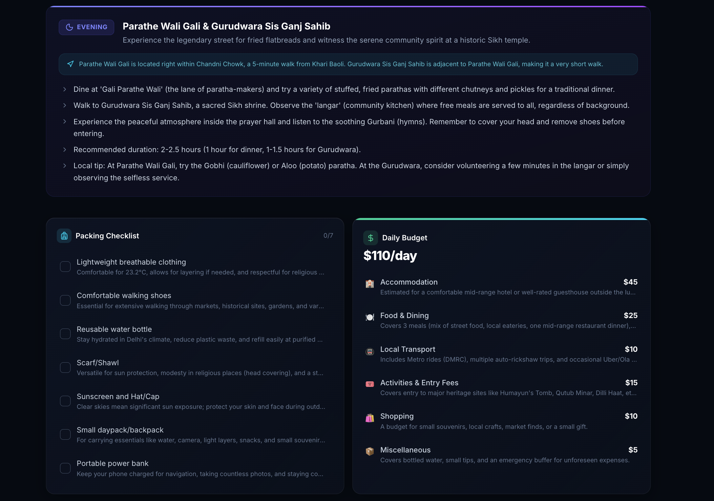

<div align="center">
  
  <h1 align="center">Horizon</h1>
  <p align="center">
    <strong>Discover your next adventure with AI-powered intelligence.</strong>
    <br />
    <br />
    <a href="https://nextjs.org/">Next.js 15</a>
    ·
    <a href="https://tailwindcss.com/">Tailwind CSS V4</a>
    ·
    <a href="https://ai.google.dev/">Gemini AI 2.5</a>
  </p>
</div>

<br/>

## 📸 Screenshots

<details open>
<summary><b>Landing Page</b></summary>
<br/>

</details>

<details open>
<summary><b>Itinerary Dashboard</b></summary>
<br/>

</details>

<details open>
<summary><b>Budget & Packing List</b></summary>
<br/>

</details>

<br/>

## ✨ Features

- **Dynamic Itinerary Generation:** Get highly detailed 1-10 day travel plans complete with morning, afternoon, and evening activities, photo spots, and entry fees.
- **Smart Budget Breakdown:** Provides a detailed 6-8 category cost breakdown for your trip (Accommodation, Dining, Transport, etc.).
- **Interactive Packing List:** Weather-aware packing recommendations with an interactive checklist to mark items as you pack.
- **Live Weather Integration:** Fetches real-time weather data for your destination via the Open-Meteo API.
- **Premium Glassmorphic UI:** A stunning, modern interface with interactive elements, animated gradients, and seamless transitions.
- **Downloadable Plans:** Export your complete travel itinerary and budget to a downloadable text file for offline use.

## 🛠️ Tech Stack

- **Framework:** [Next.js 15](https://nextjs.org/) (App Directory, Server Actions)
- **Styling:** [Tailwind CSS V4](https://tailwindcss.com/)
- **AI Engine:** [Google Gemini 2.5 Flash](https://ai.google.dev/)
- **Weather API:** [Open-Meteo](https://open-meteo.com/)
- **Icons:** [Lucide React](https://lucide.dev/)
- **Fonts:** [Geist](https://vercel.com/font) & [Inter](https://fonts.google.com/specimen/Inter)

## 🚀 Getting Started

### Prerequisites

You'll need a Google Gemini API key to power the travel intelligence engine. Get one at [Google AI Studio](https://aistudio.google.com/).

### Installation

1. **Clone the repository:**
   ```bash
   git clone https://github.com/your-username/horizon.git
   cd horizon
   ```

2. **Install dependencies:**
   ```bash
   npm install
   ```

3. **Set up environment variables:**
   Create a `.env.local` file in the root directory and add your Gemini API key:
   ```env
   GEMINI_API_KEY=your_api_key_here
   ```

4. **Run the development server:**
   ```bash
   npm run dev
   ```

5. **Open the app:**
   Navigate to [http://localhost:3000](http://localhost:3000) in your browser.

## 🎨 Design System

Horizon features a custom design system built with vanilla CSS variables and Tailwind utility classes:
- **`glass-card` & `glass-panel`**: Reusable semi-transparent surface components.
- **Micro-animations**: Hover states include soft scaling, glows (`glow-pulse`), and gradient shimmers to keep the interface feeling alive.
- **Color Palette**: Deep space background with cyan-to-indigo accent gradients.

## 📄 License

This project is licensed under the MIT License - see the [LICENSE](LICENSE) file for details.
